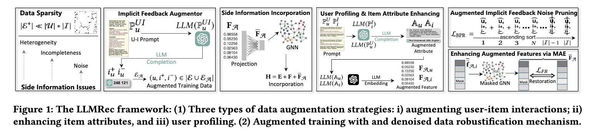

# LLMRec: Large Language Models with Graph Augmentation for Recommendation

PyTorch implementation for WSDM 2024 paper [LLMRec: Large Language Models with Graph Augmentation for Recommendation](https://llmrec.files.wordpress.com/2023/10/wsdm2024_llmrec_large_language_models_with_graph_augmentation_for_recommendation.pdf).

[Wei Wei](#), [Xubin Ren](https://rxubin.com/), [Jiabin Tang](https://tjb-tech.github.io/), [Qingyong Wang](#), [Lixin Su](#), [Suqi Cheng](#), [Junfeng Wang](#), [Dawei Yin](https://www.yindawei.com/) and [Chao Huang](https://sites.google.com/view/chaoh/home)*.
(*Correspondence)

**[Data Intelligence Lab](https://sites.google.com/view/chaoh/home)@[University of Hong Kong](https://www.hku.hk/)**, Baidu Inc.


<a href='https://llmrec.github.io/'></a>
<a href='#'></a> 
<a href='https://arxiv.org/abs/2310.13023'></a> 
[](#)


This repository hosts the code, original data and augmented data of **LLMRec**.

-----------

<p align="center">

</p>

LLMRec is a novel framework that enhances recommenders by applying three simple yet effective LLM-based graph augmentation strategies to recommendation system. LLMRec is to make the most of the content within online platforms (e.g., Netflix, MovieLens) to augment interaction graph by i) reinforcing u-i interactive edges, ii) enhancing item node attributes, and iii) conducting user node profiling, intuitively from the natural language perspective.


## 🎉 News 

📢📢 We have made significant updates to the **models** and **data** used in our GraphGPT on 🤗 **Huggingface**. We highly recommend referring to the table below for further details: 

| 🤗 Huggingface Address                                        | 🎯 Description                                                |
| ------------------------------------------------------------ | ------------------------------------------------------------ |
| [huggingface.co/Jiabin99/GraphGPT-7B-mix-all](https://huggingface.co/Jiabin99/GraphGPT-7B-mix-all) | It's the checkpoint of our GraphGPT based on Vicuna-7B-v1.5 tuned on instruction data [Arxiv-PubMed-mix-NC-LP](https://huggingface.co/datasets/Jiabin99/Arxiv-PubMed-mix-NC-LP) |
| [huggingface.co/Jiabin99/Arxiv-PubMed-GraphCLIP-GT](https://huggingface.co/Jiabin99/Arxiv-PubMed-GraphCLIP-GT) | It's the checkpoint of the pre-trained graph transformer (GT) trained on Arxiv and PubMed using Text-Graph grounding. |
| [huggingface.co/datasets/Jiabin99/Arxiv-PubMed-mix-NC-LP](https://huggingface.co/datasets/Jiabin99/Arxiv-PubMed-mix-NC-LP) | This's the mixing instruction dataset with node classification (NC) and link prediction (LP) on Arxiv and PubMed. |
| [huggingface.co/datasets/Jiabin99/GraphGPT-eval-instruction](https://huggingface.co/datasets/Jiabin99/GraphGPT-eval-instruction) | We release all instruction dataset for our evaluation.       |
| [huggingface.co/datasets/Jiabin99/All_pyg_graph_data](https://huggingface.co/datasets/Jiabin99/All_pyg_graph_data) | We merge all utilized graph data.                            |

- [x] [2023.10.26]🔥🔥Release our utilized Instruction data.

- [x] [2023.10.26]🔥🔥Release checkpoints of our GraphGPT and pre-trained graph encoder.

- [x] [2023.10.23] 🚀🚀 The full paper of our GraphGPT is available at [https://arxiv.org/abs/2310.13023](https://arxiv.org/abs/2310.13023). Please check out it and give us more feedbacks! 

- [x] [2023.10.15] 🚀🚀 Release the code of GraphGPT.


<h2>Dependencies </h2>

```
pip install -r requirments.txt
```


<h2>Usage </h2>

<h4>Stage 1: LLM-based Data Augmentation</h4>

```
cd LLMRec/LLM_augmentation/
python ./try_gpt_ui_aug.py
python ./try_gpt_user_profiling.py
python ./try_gpt_i_attribute_generate_aug.py
```

<h4>Stage 2: Recommender training with LLM-augmented Data</h4>

```
cd LLMRec/
python ./main.py --dataset {DATASET}
```
Supported datasets:  `netflix`, `movielens`


<h2> Datasets </h2>

  ```
  ├─ LLMRec/ 
      ├── data/
        ├── netflix/
        ...
  ```
| Dataset       | Netflix |                             | MovieLens                                |
|---------------|---------|-----------------------------|------------------------------------------|
| Graph         | Ori.    | U                           | I                                        |
|               |         | 13187                       | 17366                                    |
|               | Aug.    | E                           | 26374                                    |
| Ori. Sparsity |         | 99.970%                     | 99.915%                                  |
| Att.          | Ori.    | U: None                     | I: year, title                           |
|               | Aug.    | U[1536]                     | age, gender, liked genre, disliked genre |
|               |         | I[1536]                     | director, country, language              |
| Modality      |         | Textual[768], Visiual [512] | Textual [768], Visiual [512]             |


<h1> Citing </h1>

If you find this work helpful to your research, please kindly consider citing our paper.


```
@inproceedings{wei2023llmrec,
  title={LLMRec: Large Language Models with Graph Augmentation for Recommendation},
  author={Wei, Wei and Ren, Xubin and Tang, Jaibin and Wang, Qingyong and Su, Lixin and Cheng, Suqi and Wang, Junfeng and Yin, Dawei and Huang, Chao},
  journal={arXiv preprint arXiv:2308.05697},
  year={2023}
}
```


## Acknowledgement

The structure of this code is largely based on [MMSSL](https://github.com/HKUDS/MMSSL), [LATTICE](https://github.com/CRIPAC-DIG/LATTICE). Thank them for their work.

