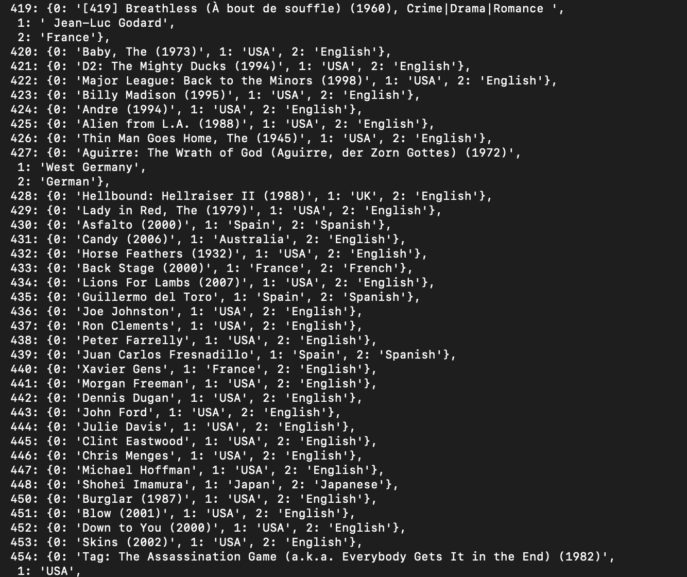

# LLMRec: Large Language Models with Graph Augmentation for Recommendation


PyTorch implementation for WSDM 2024 paper [LLMRec: Large Language Models with Graph Augmentation for Recommendation](https://arxiv.org/pdf/2311.00423.pdf).


[Wei Wei](#), [Xubin Ren](https://rxubin.com/), [Jiabin Tang](https://tjb-tech.github.io/), [Qingyong Wang](#), [Lixin Su](#), [Suqi Cheng](#), [Junfeng Wang](#), [Dawei Yin](https://www.yindawei.com/) and [Chao Huang](https://sites.google.com/view/chaoh/home)*.
(*Correspondence)

**[Data Intelligence Lab](https://sites.google.com/view/chaoh/home)@[University of Hong Kong](https://www.hku.hk/)**, Baidu Inc.

<a href='https://llmrec.github.io/'></a>
<a href='https://llmrec.github.io/'></a>
<a href='https://arxiv.org/pdf/2311.00423.pdf'></a> 
[](https://www.youtube.com/channel/UC1wKlPPlP9zKGYk62yR0K_g)


This repository hosts the code, original data and augmented data of **LLMRec**.

-----------

<p align="center">

</p>

LLMRec is a novel framework that enhances recommenders by applying three simple yet effective LLM-based graph augmentation strategies to recommendation system. LLMRec is to make the most of the content within online platforms (e.g., Netflix, MovieLens) to augment interaction graph by i) reinforcing u-i interactive edges, ii) enhancing item node attributes, and iii) conducting user node profiling, intuitively from the natural language perspective.

-----------

## 🎉 News 📢📢  

- [x] [2024.3.20] 🚀🚀 📢📢📢📢🌹🔥🔥🚀🚀 Because baselines `LATTICE` and `MMSSL` require some minor modifications, we provide code that can be easily run by simply modifying the dataset path.

- [x] [2023.11.3] 🚀🚀 Release the script for constructing the prompt.

- [x] [2023.11.1] 🔥🔥 Release the multi-modal datasets (Netflix, MovieLens), including textual data and visual data.

- [x] [2023.11.1] 🚀🚀 Release LLM-augmented textual data(by gpt-3.5-turbo-0613), and LLM-augmented embedding(by text-embedding-ada-002).

- [x] [2023.10.28] 🔥🔥 The full paper of our LLMRec is available at [LLMRec: Large Language Models with Graph Augmentation for Recommendation](https://arxiv.org/pdf/2311.00423.pdf).

- [x] [2023.10.28] 🚀🚀 Release the code of LLMRec.


## 👉 TODO 

- [ ] Provide different larger version of the datasets.
- [ ] ...


-----------

<h2> Dependencies </h2>

```
pip install -r requirements.txt
```


<h2>Usage </h2>

<h4>Stage 1: LLM-based Data Augmentation</h4>

```
cd LLMRec/LLM_augmentation/
python ./gpt_ui_aug.py
python ./gpt_user_profiling.py
python ./gpt_i_attribute_generate_aug.py
```


<h4>Stage 2: Recommender training with LLM-augmented Data</h4>

```
cd LLMRec/
python ./main.py --dataset {DATASET}
```
Supported datasets:  `netflix`, `movielens`

Specific code execution example on 'netflix':
```
# LLMRec
python ./main.py

# w/o-u-i
python ./main.py --aug_sample_rate=0.0

# w/o-u
python ./main.py --user_cat_rate=0

# w/o-u&i
python ./main.py --user_cat_rate=0  --item_cat_rate=0

# w/o-prune
python ./main.py --prune_loss_drop_rate=0
```


-----------


<h2> Datasets </h2>

  ```
  ├─ LLMRec/ 
      ├── data/
        ├── netflix/
        ...
  ```

<h3> Multi-modal Datasets </h3>
🌹🌹 Please cite our paper if you use the 'netflix' dataset~ ❤️  

We collected a multi-modal dataset using the original [Netflix Prize Data](https://www.kaggle.com/datasets/netflix-inc/netflix-prize-data) released on the [Kaggle](https://www.kaggle.com/) website. The data format is directly compatible with state-of-the-art multi-modal recommendation models like [LLMRec](https://github.com/HKUDS/LLMRec), [MMSSL](https://github.com/HKUDS/MMSSL), [LATTICE](https://github.com/CRIPAC-DIG/LATTICE), [MICRO](https://github.com/CRIPAC-DIG/MICRO), and others, without requiring any additional data preprocessing.

 `Textual Modality:` We have released the item information curated from the original dataset in the "item_attribute.csv" file. Additionally, we have incorporated textual information enhanced by LLM into the "augmented_item_attribute_agg.csv" file. (The following three images represent (1) information about Netflix as described on the Kaggle website, (2) textual information from the original Netflix Prize Data, and (3) textual information augmented by LLMs.)
<div style="display: flex; justify-content: center; align-items: flex-start;">
  <figure style="text-align: center; margin: 10px;">
   
<!--     <figcaption>Textual data in original 'Netflix Prize Data' on Kaggle.</figcaption> -->
  </figure>

  <figure style="text-align: center; margin: 10px;">
    
<!--     <figcaption>Textual data in original 'Netflix Prize Data'.</figcaption> -->
  </figure>

  <figure style="text-align: center; margin: 10px;">
    
<!--     <figcaption>LLM-augmented textual data.</figcaption> -->
  </figure>  
</div>
 
 `Visual Modality:` We have released the visual information obtained from web crawling in the "Netflix_Posters" folder. (The following image displays the poster acquired by web crawling using item information from the Netflix Prize Data.)
 <div style="display: flex; justify-content: center; align-items: flex-start;">
  <figure style="text-align: center; margin: 10px;">
   
<!--     <figcaption>Textual data in original 'Netflix Prize Data' on Kaggle.</figcaption> -->
  </figure>
</div>
 

<h3> Original Multi-modal Datasets & Augmented Datasets </h3>
 <div style="display: flex; justify-content: center; align-items: flex-start;">
  <figure style="text-align: center; margin: 10px;">
   
<!--     <figcaption>Textual data in original 'Netflix Prize Data' on Kaggle.</figcaption> -->
  </figure>
</div>


<br>
<p>

<h3> Download the Netflix dataset. </h3>
🚀🚀
We provide the processed data (i.e., CF training data & basic user-item interactions, original multi-modal data including images and text of items, encoded visual/textual features and LLM-augmented text/embeddings).  🌹 We hope to contribute to our community and facilitate your research 🚀🚀 ~

- `netflix`: [Google Drive Netflix](https://drive.google.com/drive/folders/1BGKm3nO4xzhyi_mpKJWcfxgi3sQ2j_Ec?usp=drive_link).  [🌟(Image&Text)](https://drive.google.com/file/d/1euAnMYD1JBPflx0M86O2M9OsbBSfrzPK/view?usp=drive_link)


<h3> Encoding the Multi-modal Content. </h3>

We use [CLIP-ViT](https://huggingface.co/openai/clip-vit-base-patch32) and [Sentence-BERT](https://www.sbert.net/) separately as encoders for visual side information and textual side information.


-----------


<h2> Prompt & Completion Example </h2>
<h4> LLM-based Implicit Feedback Augmentation </h4>

> Prompt 
>> Recommend user with movies based on user history  that each movie with title, year, genre. History: [332] Heart and Souls (1993), Comedy|Fantasy [364] Men with Brooms(2002), Comedy|Drama|Romance Candidate: [121]The Vampire Lovers (1970), Horror [155] Billabong Odyssey (2003),Documentary [248]The Invisible Guest 2016, Crime, Drama, Mystery   Output index of user's favorite and dislike movie from candidate.Please just give the index in [].

> Completion
>> 248   121

<h4> LLM-based User Profile Augmentation </h4>

> Prompt 
>> Generate user profile based on the history of user, that each movie with title, year, genre. History: [332] Heart and Souls (1993), Comedy|Fantasy [364] Men with Brooms (2002), Comedy|Drama|Romance  Please output the following infomation of user, output format: {age: , gender: , liked genre: , disliked genre: , liked directors: , country: , language: }

> Completion
>> {age: 50, gender: female, liked genre: Comedy|Fantasy, Comedy|Drama|Romance, disliked genre: Thriller, Horror, liked directors: Ron Underwood, country: Canada, United States, language: English}


<h4> LLM-based Item Attributes Augmentation </h4>

> Prompt 
>> Provide the inquired information of the given movie. [332] Heart and Souls (1993), Comedy|Fantasy The inquired information is: director, country, language. And please output them in form of: director, country, language 

> Completion
>> Ron Underwood, USA, English


<h2> Augmented Data </h2>

<h4> Augmented Implicit Feedback (Edge) </h4>
For each user, 0 represents a positive sample, and 1 represents a negative sample.
  <figure style="text-align: center; margin: 10px;">
    
<!--     <figcaption>Textual data in original 'Netflix Prize Data'.</figcaption> -->
  </figure>


<h4> Augmented User Profile (User Node) </h4>
For each user, the dictionary stores augmented information such as 'age,' 'gender,' 'liked genre,' 'disliked genre,' 'liked directors,' 'country,' and 'language.'
  <figure style="text-align: center; margin: 10px;">
    
<!--     <figcaption>Textual data in original 'Netflix Prize Data'.</figcaption> -->
  </figure>


##### Augmented item attribute
For each item, the dictionary stores augmented information such as 'director,' 'country,' and 'language.'
  <figure style="text-align: center; margin: 10px;">
    
<!--     <figcaption>Textual data in original 'Netflix Prize Data'.</figcaption> -->
  </figure>


<h2> Candidate Preparing for LLM-based Implicit Feedback Augmentation</h2>

 step 1: select base model such as MMSSL or LATTICE
 
 step 2: obtain user embedding and item embedding
 
 step 3: generate candidate
```
      _, candidate_indices = torch.topk(torch.mm(G_ua_embeddings, G_ia_embeddings.T), k=10)  
      pickle.dump(candidate_indices.cpu(), open('./data/' + args.datasets +  '/candidate_indices','wb'))
```
Example of specific candidate data.
```
In [3]: candidate_indices
Out[3]: 
tensor([[ 9765,  2930,  6646,  ..., 11513, 12747, 13503],
        [ 3665,  8999,  2587,  ...,  1559,  2975,  3759],
        [ 2266,  8999,  1559,  ...,  8639,   465,  8287],
        ...,
        [11905, 10195,  8063,  ..., 12945, 12568, 10428],
        [ 9063,  6736,  6938,  ...,  5526, 12747, 11110],
        [ 9584,  4163,  4154,  ...,  2266,   543,  7610]])

In [4]: candidate_indices.shape
Out[4]: torch.Size([13187, 10])
```


-----------

<h1> Citing </h1>

If you find this work helpful to your research, please kindly consider citing our paper.


```
@article{wei2023llmrec,
  title={LLMRec: Large Language Models with Graph Augmentation for Recommendation},
  author={Wei, Wei and Ren, Xubin and Tang, Jiabin and Wang, Qinyong and Su, Lixin and Cheng, Suqi and Wang, Junfeng and Yin, Dawei and Huang, Chao},
  journal={arXiv preprint arXiv:2311.00423},
  year={2023}
}
```


## Acknowledgement

The structure of this code is largely based on [MMSSL](https://github.com/HKUDS/MMSSL), [LATTICE](https://github.com/CRIPAC-DIG/LATTICE), [MICRO](https://github.com/CRIPAC-DIG/MICRO). Thank them for their work.

